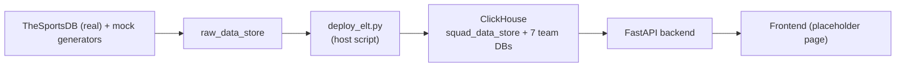

# squad-console

A national-team manager console: log in by tapping your federation's crest (no typing), see a full dashboard of your own squad, "inspect" the other 6 teams with private fields redacted, and ask a RAG-backed chatbot tactical questions that respect the same privacy rules. Built on FastAPI, ClickHouse, ChromaDB, LangGraph, React/Tailwind, and Docker Compose.

The public product name is intentionally kept **out of every layer except the frontend** — repo, services, database names, and code all use the neutral name `squad-console` so the brand can change later without touching infrastructure.

## Table of contents

- [Current status](#current-status)
- [Architecture](#architecture)
- [Repo layout](#repo-layout)
- [Prerequisites](#prerequisites)
- [Docker Compose setup SOP](#docker-compose-setup-sop)
- [What's already inside each container](#whats-already-inside-each-container)
- [The product: public vs. private data](#the-product-public-vs-private-data)
- [Populating real data (ingestion)](#populating-real-data-ingestion)
- [Data persistence SOP](#data-persistence-sop)
- [Backing up and restoring ClickHouse data](#backing-up-and-restoring-clickhouse-data)
- [Adding your LLM API key later](#adding-your-llm-api-key-later)
- [Roadmap](#roadmap)

## Current status

Infrastructure base is up: three containers (ClickHouse, FastAPI backend, a placeholder React/Tailwind frontend) on one Docker network, each independently health-checked, with a persistent volume for ClickHouse. The frontend is still a minimal placeholder page — no login/dashboard/chat UI yet — but the **backend API is real and functional**:

- Every team has a **full, real 26-man squad** (Wikipedia's 2026 World Cup squads, cross-referenced with TheSportsDB for photos), plus real clubs/matches/trophies and synthetic values for fields with no free source — see [The product: public vs. private data](#the-product-public-vs-private-data).
- **Access control is implemented and enforced**, not just designed: `GET /api/dashboard/{team}` (full, own team only) and `GET /api/inspect/{team}` (redacted, any other team) both run through one shared `access_control.py`.
- **Charts render server-side and are callable directly** — `GET /api/charts/{team}/injury-risk` and `/top-performers` return a PNG URL with zero LLM involvement. This is the deterministic half of the "hybrid" chat design described below.
- **Data provenance is a first-class API**, not just a doc comment — `GET /api/data-sources` tells you exactly which fields are real (and from where) vs. synthetic (and why).

No LLM key is configured yet — that's the next phase (LangGraph agent + RAG), listed in [Roadmap](#roadmap).

## Architecture

See `architecture/ARCHITECTURE.md` for the full narrative and `architecture/diagrams.md` for the diagrams (high-level flow, chatbot request flow, container/persistence layout, access-control matrix). For a browsable map of how every API/service/data store connects, open `obsidian-graph/` as an Obsidian vault (or just read the markdown — it renders fine on GitHub too).



## Repo layout

```
.
├── architecture/       # narrative + Mermaid diagrams
├── obsidian-graph/      # backlinked notes mapping how everything connects
├── database/clickhouse/ # schema (init/) + SOPs
├── backend/             # FastAPI app
├── ingestion/           # host-run ELT pipeline: real TheSportsDB data + synthetic fields -> ClickHouse
├── embedding_job/       # placeholder — Chroma embedding job (RAG phase)
├── knowledge_base/      # placeholder — bind-mounted tactical docs (RAG phase)
├── frontend/            # minimal Vite+React+Tailwind placeholder — the only place brand name/UI lives
├── docker-compose.yml
├── .env.example
└── .env                 # your local copy, gitignored — never committed
```

## Prerequisites

- Docker Desktop (or another Docker Engine + Compose v2)
- That's it to run this pass — no Python/Node install needed locally, everything runs in containers.

## Docker Compose setup SOP

Three containers — `clickhouse`, `backend`, `frontend` — on one Docker network (`squadnet`), brought up together with a single `docker-compose.yml`. Steps below take you from a fresh clone to all three verified healthy.

**1. Clone and configure**

```bash
git clone <this-repo-url>
cd squad-console
cp .env.example .env       # already has working defaults; edit if you have API keys
```

**2. Build and start every container**

```bash
docker compose up -d --build
```

This creates, in order: the `squadnet` network → the `clickhouse_data` named volume → the `clickhouse` container (schema self-creates on first boot from `database/clickhouse/init/`) → the `backend` container (waits for ClickHouse to report healthy) → the `frontend` container (waits for the backend to report healthy).

**3. Watch it come up**

```bash
docker compose ps
```

All three should settle on `Up ... (healthy)` within about 30 seconds on a first build (ClickHouse takes the longest — it's creating 8 databases). If `clickhouse` briefly shows `unhealthy` right after the very first boot, give it one restart: `docker compose restart clickhouse` (a known one-time race between its init-script bootstrap and the real server binding its ports — see `database/clickhouse/README.md`).

**4. Verify each service individually**

```bash
# ClickHouse — HTTP interface directly
curl "http://localhost:8123/ping"                                            # Ok.
curl "http://localhost:8123/?query=SHOW+DATABASES" --user default:changeme   # lists all 8 DBs

# Backend — FastAPI
curl localhost:8000/api/health              # {"status": "ok"}
curl localhost:8000/api/health/clickhouse   # confirms squad_data_store + all 7 team DBs exist

# Frontend — placeholder page (calls the backend health check itself)
open http://localhost:3000
```

**Common commands**

| Command | Effect |
|---|---|
| `docker compose up -d` | Start everything (build only if images don't exist yet) |
| `docker compose up -d --build` | Rebuild images first, then start — use after changing backend/frontend code or their Dockerfiles |
| `docker compose logs -f <service>` | Tail logs for one container (`clickhouse`, `backend`, or `frontend`) |
| `docker compose restart <service>` | Restart a single container without touching the others |
| `docker compose ps` | Show container status + health |
| `docker compose down` | Stop and remove containers (volume survives) |
| `docker compose down -v` | Stop and remove containers **and** the ClickHouse volume — destructive, see below |

## What's already inside each container

| Container | Image / base | Exposed on host | What's there right now |
|---|---|---|---|
| `clickhouse` | `clickhouse/clickhouse-server:24.8-alpine` | `8123` (HTTP), `9000` (native) | 9 databases: `squad_data_store` (master, partitioned by `team_code`), `raw_data_store` (raw API dump audit trail), + `england`/`france`/`brazil`/`argentina`/`spain`/`germany`/`portugal`. Each team DB has the 9 tables from `database/clickhouse/init/` (`players`, `public_stats`, `injuries`, `salaries`, `training_load`, `formations`, `clubs`, `trophies`, `matches`), **populated** — real squad/match/trophy data plus synthetic fields, via `ingestion/`. Default credentials from `.env` (`default` / `changeme` — change before this ever holds real *private* data). |
| `backend` | `python:3.12-slim` + FastAPI/uvicorn | `8000` | `GET /api/health`, `GET /api/health/clickhouse` — liveness. `POST /api/session/select-team`, `GET /api/dashboard/{team}`, `GET /api/inspect/{team}` — session + access-controlled squad data. `GET /api/data-sources` — real-vs-synthetic transparency breakdown. `GET /api/charts/{team}/injury-risk`, `/top-performers`, `GET /api/charts/file/{filename}` — server-rendered matplotlib PNGs, callable with no LLM. `chat`/LangGraph endpoint comes in the next phase. |
| `frontend` | `node:20-alpine` build → `nginx:alpine` serve | `3000` (→ container port `80`) | One static placeholder page (Vite + React + Tailwind) that calls the backend's ClickHouse health check and renders the result. No login/dashboard/chat UI yet — the backend API above is ready for it. |

## The product: public vs. private data

This is the actual value proposition, not just an access-control exercise. It mirrors how a real federation is organized: **public** is whatever the press or a rival federation could already know; **private** is your own coaching staff's internal intelligence — nobody outside your building sees it.

| | Public (any team, yours or a rival's) | Private (your own team's staff only) |
|---|---|---|
| Squad | Real bio, real stats, real club, real photo (where available) | — |
| Medical | — | Injury type, severity, expected return |
| Financial | — | Weekly wage, contract expiry |
| Sports science | — | Weekly training load, fatigue trend, **injury-risk chart** (derived from that trend) |
| Tactics | Formation *name* only | Full lineup, tactical notes, set-piece detail |
| History | Clubs, trophies, match results | — |

Every private field is synthetic because no free (or, for `public_stats`, even paid-yet) data source exists for it — see `ingestion/README.md` for the full real-vs-synthetic table, and `GET /api/data-sources` for the same breakdown surfaced live in the product itself rather than buried in docs.

## Populating real data (ingestion)

`ingestion/elt-pipeline-py-script/` runs on the **host**, deliberately outside Docker, so it can be edited and re-run with no image/container involved. It pulls real, full 26-man squads from Wikipedia (cross-referenced with TheSportsDB for photos and match results), plus synthetic values for fields with no free source (see `ingestion/README.md` for exactly which is which), and loads all of it into every ClickHouse database. It connects to ClickHouse through the port already published to `localhost` — the `clickhouse` container must be running.

```bash
cd ingestion/elt-pipeline-py-script
python3 -m venv .venv && source .venv/bin/activate
pip install -r requirements.txt
python deploy_elt.py
```

Every run is a full truncate-and-reload, so it's safe to re-run any time. Verify it worked:

```bash
docker compose exec clickhouse clickhouse-client --user default --password changeme \
  --query "SELECT name, position, club FROM england.players FORMAT PrettyCompact"
```

## Data persistence SOP

- `docker compose stop` / `docker compose start` — **preserves** the ClickHouse volume. Safe to use any time.
- `docker compose down` (no flag) — stops and removes containers, but the named volume survives; `docker compose up -d` afterwards picks up right where you left off.
- `docker compose down -v` — **destroys** the `clickhouse_data` volume and everything in it. Only use this if you actually want a clean slate (e.g. you changed a schema file under `database/clickhouse/init/` and need it to re-run).

## Backing up and restoring ClickHouse data

The data itself (as opposed to the schema, which is version-controlled SQL) lives only in the `clickhouse_data` Docker volume — it's not something that belongs in git (binary, changes constantly, would bloat the repo). To hand someone a working copy of your data, share a tarball of that volume instead. This is a raw filesystem-level backup, so it captures schema + data + everything together — whoever restores it doesn't need to run the init scripts separately.

**Owner: create a backup**

```bash
# Stop ClickHouse first so nothing is mid-write during the copy
docker compose stop clickhouse

docker run --rm \
  -v squad-console_clickhouse_data:/data \
  -v "$(pwd)":/backup \
  alpine tar czf /backup/clickhouse_data_backup.tar.gz -C /data .

docker compose start clickhouse
```

This produces `clickhouse_data_backup.tar.gz` in the repo root — share that file however you'd share any large file (it is **not** committed to git; keep it out of the repo).

**Recipient: restore a shared backup**

```bash
git clone <this-repo-url>
cd squad-console
cp .env.example .env

# Bring the stack up once so the named volume exists, then stop ClickHouse
docker compose up -d clickhouse
docker compose stop clickhouse

# Drop the shared clickhouse_data_backup.tar.gz into the repo root, then:
docker run --rm \
  -v squad-console_clickhouse_data:/data \
  -v "$(pwd)":/backup \
  alpine sh -c "rm -rf /data/* && tar xzf /backup/clickhouse_data_backup.tar.gz -C /data"

docker compose up -d
```

Verify it worked with the same health checks from the setup SOP above (`curl localhost:8000/api/health/clickhouse` should now show row counts once data exists, not just empty schema). The volume name is fixed by the compose project name (`squad-console_clickhouse_data`) — if you renamed the project in `docker-compose.yml`'s top-level `name:` field, adjust the volume name in these commands to match (`docker volume ls` shows the actual name).

## Adding your LLM API key later

This project runs fully on real + synthetic data with **no LLM key** for now — that gets added last, once the LangGraph agent phase is built. When you get there: open `.env`, fill in `ANTHROPIC_API_KEY` or `OPENAI_API_KEY` plus `LLM_MODEL`, and restart the backend (`docker compose restart backend`). Nothing else changes.

## Roadmap

Phases still to come, in order:

1. ~~**Uniform data ingestion**~~ — done: real 26-man squads (Wikipedia + TheSportsDB), matches, trophies, plus synthetic fields, via `ingestion/elt-pipeline-py-script/deploy_elt.py`. Still open: API-Football (real `public_stats`, needs a paid key), Transfermarkt/RSS fetchers, and an Airflow layer to schedule/automate re-fetching instead of running `deploy_elt.py` by hand.
2. ~~**Access control + REST API**~~ — done: `access_control.py` (single source of truth), `session`/`dashboard`/`inspect` routers, `data-sources` transparency endpoint.
3. ~~**Charts (deterministic half)**~~ — done: `backend/app/charts/generators.py` + `/api/charts/*` router, callable directly with zero LLM involvement — this is the non-agentic half of the "hybrid" chat design.
4. **RAG pipeline** — `knowledge_base/` content, `embedding_job/`, ChromaDB.
5. **Agentic layer (agentic half of "hybrid")** — LangGraph agent (`backend/app/langgraph_app/`), wired to a `chat` endpoint. Its `chart_node` calls the *same* chart generator functions the deterministic router uses for free-form questions. This is when an LLM key is finally needed.
6. **Real frontend** — login, dashboard, inspect, and chat pages (with quick-reply "chips" that call the chart API directly, no LLM) replace the current placeholder page in `frontend/`.
7. **Nginx + full docker-compose** — reverse proxy in front of frontend + backend, remaining named volume (`chroma_data`).
8. **Deployment** — containerized services on a host that supports the full Compose stack; a static frontend build can go on Vercel separately, but ClickHouse/ChromaDB/the backend need a real container host (Vercel doesn't run long-lived stateful containers).
