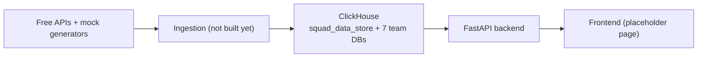

# squad-console

A national-team manager console: log in by tapping your federation's crest (no typing), see a full dashboard of your own squad, "inspect" the other 6 teams with private fields redacted, and ask a RAG-backed chatbot tactical questions that respect the same privacy rules. Built on FastAPI, ClickHouse, ChromaDB, LangGraph, React/Tailwind, and Docker Compose.

The public product name is intentionally kept **out of every layer except the frontend** — repo, services, database names, and code all use the neutral name `squad-console` so the brand can change later without touching infrastructure.

## Table of contents

- [Current status](#current-status)
- [Architecture](#architecture)
- [Repo layout](#repo-layout)
- [Prerequisites](#prerequisites)
- [Quickstart SOP](#quickstart-sop)
- [Data persistence SOP](#data-persistence-sop)
- [Adding your LLM API key later](#adding-your-llm-api-key-later)
- [Roadmap](#roadmap)

## Current status

This pass stands up the **infrastructure base**: three containers (ClickHouse, FastAPI backend, a placeholder React/Tailwind frontend) on one Docker network, wired together and each independently health-checked, with a persistent volume for ClickHouse. The frontend is a minimal placeholder page that proves it can reach the backend and confirm the ClickHouse schema — no login, dashboard, or chatbot yet. No data is loaded yet and no LLM key is configured — those are later phases, listed in [Roadmap](#roadmap).

## Architecture

See `architecture/ARCHITECTURE.md` for the full narrative and `architecture/diagrams.md` for the diagrams (high-level flow, chatbot request flow, container/persistence layout, access-control matrix). For a browsable map of how every API/service/data store connects, open `obsidian-graph/` as an Obsidian vault (or just read the markdown — it renders fine on GitHub too).



## Repo layout

```
.
├── architecture/       # narrative + Mermaid diagrams
├── obsidian-graph/      # backlinked notes mapping how everything connects
├── database/clickhouse/ # schema (init/) + SOPs
├── backend/             # FastAPI app
├── ingestion/           # placeholder — free-API fetchers + mock generators (next phase)
├── embedding_job/       # placeholder — Chroma embedding job (RAG phase)
├── knowledge_base/      # placeholder — bind-mounted tactical docs (RAG phase)
├── frontend/            # minimal Vite+React+Tailwind placeholder — the only place brand name/UI lives
├── docker-compose.yml
├── .env.example
└── .env                 # your local copy, gitignored — never committed
```

## Prerequisites

- Docker Desktop (or another Docker Engine + Compose v2)
- That's it to run this pass — no Python/Node install needed locally, everything runs in containers.

## Quickstart SOP

```bash
git clone <this-repo-url>
cd squad-console
cp .env.example .env       # already has working defaults; edit if you want
docker compose up -d
```

Verify it's up:

```bash
curl localhost:8000/api/health              # {"status": "ok"}
curl localhost:8000/api/health/clickhouse   # confirms squad_data_store + all 7 team DBs exist
open http://localhost:3000                  # placeholder frontend, shows the same health check
```

Or inspect the schema directly:

```bash
docker compose exec clickhouse clickhouse-client --query "SHOW DATABASES"
```

## Data persistence SOP

- `docker compose stop` / `docker compose start` — **preserves** the ClickHouse volume. Safe to use any time.
- `docker compose down` (no flag) — stops and removes containers, but the named volume survives; `docker compose up -d` afterwards picks up right where you left off.
- `docker compose down -v` — **destroys** the `clickhouse_data` volume and everything in it. Only use this if you actually want a clean slate (e.g. you changed a schema file under `database/clickhouse/init/` and need it to re-run).

## Adding your LLM API key later

This project runs fully on mock data with **no LLM key** for now — that gets added last, once the LangGraph agent phase is built. When you get there: open `.env`, fill in `ANTHROPIC_API_KEY` or `OPENAI_API_KEY` plus `LLM_MODEL`, and restart the backend (`docker compose restart backend`). Nothing else changes.

## Roadmap

Phases still to come, in order:

1. **Uniform data ingestion** — free-API fetchers (API-Football, TheSportsDB, Transfermarkt, RSS) and mock generators, both producing the same JSON shape, loaded into ClickHouse via `ingestion/partition.py`.
2. **Data engineering pass** — once ingestion exists, review the data shapes together and refine the schema before building on top of it.
3. **RAG pipeline** — `knowledge_base/` content, `embedding_job/`, ChromaDB.
4. **Agentic layer** — LangGraph agent (`backend/app/langgraph_app/`), wired to the `chat` endpoint. This is when an LLM key is finally needed.
5. **Charts** — matplotlib/seaborn chart generation from the agent.
6. **Real frontend** — login, dashboard, inspect, and chat pages replace the current placeholder page in `frontend/`.
7. **Nginx + full docker-compose** — reverse proxy in front of frontend + backend, remaining named volumes (`chroma_data`, `charts_data`).
8. **Deployment** — containerized services on a host that supports the full Compose stack; a static frontend build can go on Vercel separately, but ClickHouse/ChromaDB/the backend need a real container host (Vercel doesn't run long-lived stateful containers).
