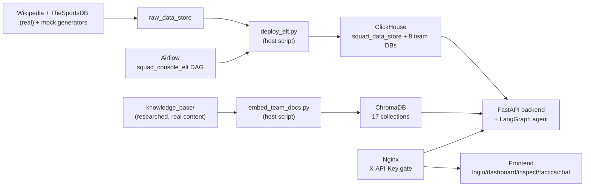

# squad-console

A national-team manager console: log in by tapping your federation's crest (no typing), see a full dashboard of your own squad, "inspect" the other 7 teams with private fields redacted, and ask a RAG-backed chatbot tactical questions that respect the same privacy rules. Built on FastAPI, ClickHouse, ChromaDB, LangGraph, React/Tailwind, and Docker Compose.

The public product name is intentionally kept **out of every layer except the frontend** — repo, services, database names, and code all use the neutral name `squad-console` so the brand can change later without touching infrastructure.

## Table of contents

- [Current status](#current-status)
- [Architecture](#architecture)
- [Repo layout](#repo-layout)
- [Prerequisites](#prerequisites)
- [Docker Compose setup SOP](#docker-compose-setup-sop)
- [What's already inside each container](#whats-already-inside-each-container)
- [Nginx + API key gate](#nginx--api-key-gate)
- [The hybrid chat design: 3 chips, zero LLM](#the-hybrid-chat-design-3-chips-zero-llm)
- [The product: public vs. private data](#the-product-public-vs-private-data)
- [Populating real data (ingestion)](#populating-real-data-ingestion)
- [Knowledge base + RAG (no LLM needed yet)](#knowledge-base--rag-no-llm-needed-yet)
- [Data persistence SOP](#data-persistence-sop)
- [Backing up and restoring ClickHouse data](#backing-up-and-restoring-clickhouse-data)
- [Adding your LLM API key later](#adding-your-llm-api-key-later)
- [Scheduled ingestion with Airflow](#scheduled-ingestion-with-airflow)
- [Deployment: Vercel + Cloudflare Tunnel](#deployment-vercel--cloudflare-tunnel)
- [Roadmap](#roadmap)

## Current status

The full app is up and working end-to-end on real data, with **no LLM key required**: six containers (ClickHouse, ChromaDB, FastAPI backend, a real React/Tailwind frontend, Nginx, Airflow) on one Docker network, each independently health-checked.

- Every team has a **full, real 26-man squad** (Wikipedia's 2026 World Cup squads, cross-referenced with TheSportsDB for photos), plus real clubs/matches/trophies and synthetic values for fields with no free source — see [The product: public vs. private data](#the-product-public-vs-private-data).
- **Access control is implemented and enforced**, not just designed: `GET /api/dashboard/{team}` (full, own team only) and `GET /api/inspect/{team}` (redacted, any other team) both run through one shared `access_control.py`.
- **The LangGraph agent is built and wired up** — the full 7-node graph (`intent_router → stats_tool → rag_retriever → access_filter → reasoner → chart_node → composer`) runs on every `/api/chat` call. Every node except `reasoner` needs no LLM; `reasoner` gracefully degrades to an honest "no LLM key configured" message instead of erroring, so the whole pipeline (real ClickHouse stats, real ChromaDB retrieval, access filtering, chart generation) is verifiably exercised today.
- **3 analyst "chip" reports are built and live** — `GET /api/reports/fitness`, `/top-performers`, `/financial` return a fixed text template with *live* stats plus a chart, in the exact `{text, chart_url}` shape `/api/chat` also returns. See [The hybrid chat design](#the-hybrid-chat-design-3-chips-zero-llm).
- **The real frontend is built** — login (7 crests), dashboard, inspect, tactics & formations (SVG pitch diagrams), news placeholder, and a persistent "Ask the analyst" chat panel with the 3 chips + a free-form chatbox, all matching the original design wireframes. Verified end-to-end in a real browser (Playwright) — see `frontend/README.md`.
- **Data provenance is a first-class API**, not just a doc comment — `GET /api/data-sources` tells you exactly which fields are real (and from where) vs. synthetic (and why).
- **Nginx is the front door with an API-key gate** — see [Nginx + API key gate](#nginx--api-key-gate).
- **The RAG corpus is written and embedded** — real, researched tactical dossiers for all 8 teams (formations, key-player dependencies, honest weaknesses) plus public scouting reports, chunked and embedded into ChromaDB with zero LLM calls (a local sentence-transformers model).
- **Ingestion is Airflow-orchestrated** — `squad_console_elt` DAG wraps `deploy_elt.py`'s stages as independent tasks (extract → transform → mock-generate → partition). See [Scheduled ingestion with Airflow](#scheduled-ingestion-with-airflow).
- **Deployed** — the frontend is live on Vercel, reaching the local Docker stack through a Cloudflare Tunnel. See [Deployment: Vercel + Cloudflare Tunnel](#deployment-vercel--cloudflare-tunnel).

Add `ANTHROPIC_API_KEY` or `OPENAI_API_KEY` any time to switch the chatbox from its graceful fallback message to real tactical reasoning — nothing else changes. See [Adding your LLM API key later](#adding-your-llm-api-key-later).

## Architecture

See `architecture/ARCHITECTURE.md` for the full narrative and `architecture/diagrams.md` for the diagrams (high-level flow, chatbot request flow, container/persistence layout, access-control matrix). For a browsable map of how every API/service/data store connects, open `obsidian-graph/` as an Obsidian vault (or just read the markdown — it renders fine on GitHub too).



## Repo layout

```
.
├── architecture/       # narrative + Mermaid diagrams
├── obsidian-graph/      # backlinked notes mapping how everything connects
├── database/clickhouse/ # schema (init/) + SOPs
├── backend/             # FastAPI app
├── ingestion/           # ELT pipeline: real Wikipedia/TheSportsDB data + synthetic fields -> ClickHouse (host-run or Airflow-orchestrated)
├── airflow/             # Dockerfile + squad_console_elt DAG that wraps ingestion/ as scheduled tasks
├── embedding_job/       # host-run: chunks + embeds knowledge_base/ into ChromaDB, no LLM needed
├── knowledge_base/      # real, researched tactics/scouting content for all 8 teams + shared theory
├── frontend/            # Vite+React+Tailwind app: login/dashboard/inspect/tactics/news + chat panel — the only place brand name/UI lives
├── nginx/templates/     # reverse proxy + X-API-Key gate (envsubst template)
├── docker-compose.yml
├── .env.example
└── .env                 # your local copy, gitignored — never committed
```

## Prerequisites

- Docker Desktop (or another Docker Engine + Compose v2)
- That's it to run this pass — no Python/Node install needed locally, everything runs in containers.

## Docker Compose setup SOP

Six containers — `clickhouse`, `chroma`, `backend`, `frontend`, `nginx`, `airflow` — on one Docker network (`squadnet`), brought up together with a single `docker-compose.yml`. Steps below take you from a fresh clone to all six verified healthy.

**1. Clone and configure**

```bash
git clone <this-repo-url>
cd squad-console
cp .env.example .env       # already has working defaults; edit if you have API keys
```

**2. Build and start every container**

```bash
docker compose up -d --build
```

This creates, in order: the `squadnet` network → the `clickhouse_data`/`charts_data`/`chroma_data`/`airflow_home` named volumes → the `clickhouse` and `chroma` containers → the `backend` container (waits for both to report healthy) → the `frontend` container (waits for the backend) → the `nginx` container (waits for both, reverse-proxies everything behind the `X-API-Key` gate) → the `airflow` container (waits for `clickhouse`, runs the ingestion DAG in-network — see [Scheduled ingestion with Airflow](#scheduled-ingestion-with-airflow)).

**3. Watch it come up**

```bash
docker compose ps
```

All six should settle on `Up ... (healthy)` within about 30 seconds on a first build (ClickHouse takes the longest — it's creating 10 databases). If `clickhouse` briefly shows `unhealthy` right after the very first boot, give it one restart: `docker compose restart clickhouse` (a known one-time race between its init-script bootstrap and the real server binding its ports — see `database/clickhouse/README.md`).

**4. Verify each service individually**

```bash
# ClickHouse — HTTP interface directly
curl "http://localhost:8123/ping"                                            # Ok.
curl "http://localhost:8123/?query=SHOW+DATABASES" --user default:changeme   # lists all 9 DBs

# Backend — FastAPI (direct, bypassing Nginx — still gated by its own X-API-Key check)
curl localhost:8000/api/health                                                    # {"status": "ok"}, no key needed
curl -H "X-API-Key: $(grep ^API_KEY= .env | cut -d= -f2)" localhost:8000/api/data-sources

# Through Nginx (port 80) — the real front door, same gate enforced again
curl -H "X-API-Key: $(grep ^API_KEY= .env | cut -d= -f2)" localhost/api/data-sources
curl localhost/                                                                    # frontend passthrough, no key needed

# Frontend — placeholder page (calls the backend health check itself, key baked in at build time)
open http://localhost:3000
```

**Common commands**

| Command | Effect |
|---|---|
| `docker compose up -d` | Start everything (build only if images don't exist yet) |
| `docker compose up -d --build` | Rebuild images first, then start — use after changing backend/frontend code or their Dockerfiles |
| `docker compose logs -f <service>` | Tail logs for one container (`clickhouse`, `backend`, or `frontend`) |
| `docker compose restart <service>` | Restart a single container without touching the others |
| `docker compose ps` | Show container status + health |
| `docker compose down` | Stop and remove containers (volume survives) |
| `docker compose down -v` | Stop and remove containers **and** the ClickHouse volume — destructive, see below |

## What's already inside each container

| Container | Image / base | Exposed on host | What's there right now |
|---|---|---|---|
| `clickhouse` | `clickhouse/clickhouse-server:24.8-alpine` | `8123` (HTTP), `9000` (native) | 10 databases: `squad_data_store` (master, partitioned by `team_code`), `raw_data_store` (raw API dump audit trail), + `england`/`france`/`brazil`/`argentina`/`spain`/`germany`/`portugal`/`capeverde`. Each team DB has the 9 tables from `database/clickhouse/init/` (`players`, `public_stats`, `injuries`, `salaries`, `training_load`, `formations`, `clubs`, `trophies`, `matches`), **populated** — real squad/match/trophy data plus synthetic fields, via `ingestion/`. Default credentials from `.env` (`default` / `changeme` — change before this ever holds real *private* data). |
| `chroma` | `chromadb/chroma:0.5.20` | `8001` (→ container port `8000`) | 17 collections, **populated and queried**: `{team}_full` (private tactics) + `{team}_public` (public scouting) for all 8 teams, plus `shared_theory`. Embedded via `embedding_job/` using a local sentence-transformers model — no LLM key involved. Queried live by the backend's `rag_retriever` node on every `/api/chat` call. |
| `backend` | `python:3.12-slim` + FastAPI/uvicorn | `8000` | `GET /api/health`, `GET /api/health/clickhouse` — liveness, no key needed. `POST /api/session/select-team`, `GET /api/dashboard/{team}`, `GET /api/inspect/{team}`, `GET /api/data-sources`, `GET /api/charts/{team}/injury-risk`\|`/top-performers`, `GET /api/reports/fitness`\|`/top-performers`\|`/financial`, `POST /api/chat` — all require `X-API-Key`. `GET /api/charts/file/{filename}` — serves the PNG, no key (can't attach headers to ``; access control already happened at generation time). The full LangGraph agent (`app/langgraph_app/`) runs on every `/api/chat` call — see [The hybrid chat design](#the-hybrid-chat-design-3-chips-zero-llm). CORS origins come from `CORS_ORIGINS` in `.env` (comma-separated) — add any deployed frontend's origin there. |
| `frontend` | `node:20-alpine` build → `nginx:alpine` serve | `3000` (→ container port `80`) | The real app: `Login` (8 crests), `Dashboard` (own squad, full data), `InspectSquad` (redacted view of other teams), `Tactics` (SVG pitch diagrams per formation), `News` (honest placeholder), and a persistent `ChatPanel` (3 chips + free-form chatbox) on every page. Verified end-to-end in a real browser. Also deployable to Vercel — see [Deployment](#deployment-vercel--cloudflare-tunnel). |
| `nginx` | `nginx:1.27-alpine` | `80` | Reverse proxy: `/api/*` → `backend:8000` (gated by the same `X-API-Key`, checked again independently — `OPTIONS` preflight is exempt from the key check since browsers never attach custom headers to it, see below), `/api/charts/file/*` → `backend:8000` (ungated, see above), everything else → `frontend:80`. Config is an envsubst template (`nginx/templates/default.conf.template`) so the real key never has to be hardcoded into a committed file. |
| `airflow` | `apache/airflow:2.10.4-python3.11` (custom, see `airflow/Dockerfile`) | `8080` (local-only, not routed through Nginx) | Standalone Airflow (`SequentialExecutor`, admin/admin) running the `squad_console_elt` DAG — see [Scheduled ingestion with Airflow](#scheduled-ingestion-with-airflow). |

## Nginx + API key gate

A shared secret (`API_KEY` in `.env`) is checked **twice**, independently: once by Nginx before it ever proxies a request to the backend, and again by the backend itself via a FastAPI dependency (`require_api_key` in `app/deps.py`). Either check failing returns `401`.

- **Why check it twice?** Right now `backend`'s port `8000` (and `frontend`'s `3000`) are still published directly to the host for dev convenience, so Nginx isn't the *only* way in — without the backend's own check, hitting `:8000` directly would skip the gate entirely. In a real deployment you'd close those direct ports so Nginx is the sole entrypoint (see the Roadmap).
- **Which routes are gated:** everything except `GET /api/health*` (so Docker's own healthcheck, which calls this with no headers, keeps working) and `GET /api/charts/file/{filename}` (a plain `` can't attach a custom header — the private data behind that image was already access-controlled when the chart was generated).
- **How the secret reaches Nginx without being committed to git:** `nginx/templates/default.conf.template` contains a literal `${API_KEY}` placeholder; the official Nginx image auto-runs `envsubst` on any `*.template` file under `/etc/nginx/templates/` at container start, substituting from the container's own environment (`env_file: .env`). The rendered config is never written back to the repo.
- **How the frontend gets it:** Vite bakes `VITE_*` variables into the JS bundle at *build* time, so `docker-compose.yml` passes `API_KEY` in as a build arg (`VITE_API_KEY`) to the frontend's Dockerfile. Worth being honest about the limit here: **this is inherently visible in the shipped browser bundle** (confirmed — `grep` the built JS and the key is right there in plain text). It's a real gate against casual/automated direct API access (bots, scanners, curl-without-context), not a true secret-keeping boundary — a determined user can always read it out of their own browser. That's an inherent property of any client-side "key" in a public web app, not a bug in this implementation.

Generate your own key any time with `python3 -c "import secrets; print(secrets.token_hex(24))"` and drop it into `.env`'s `API_KEY`.

**CORS and the session cookie, for cross-site deployments:** `CORS_ORIGINS` in `.env` (comma-separated) drives the backend's `CORSMiddleware` allowlist — add any deployed frontend origin here (e.g. a Vercel URL) alongside `http://localhost:3000`. Two things had to be true simultaneously for this to actually work once frontend and backend live on different sites (see [Deployment](#deployment-vercel--cloudflare-tunnel)):

- The `X-Active-Team` session cookie is set with `samesite="none", secure=True` (`backend/app/routers/session.py`) — a `Lax` cookie is silently dropped on cross-site requests, which only stayed invisible while both sides shared `localhost`. `Secure` cookies still work on `http://localhost` since browsers treat it as a trustworthy origin.
- Nginx's `/api/` location exempts `OPTIONS` from the `X-Api-Key` check (`nginx/templates/default.conf.template`) — browsers never attach custom headers to a CORS preflight request itself, only to the real request that follows, so the key gate was 401-ing every preflight before the backend's own `CORSMiddleware` ever got a chance to answer it.

## The hybrid chat design: 3 chips, zero LLM

The chat panel is persistent on the right of every page: a chatbox at the bottom (free-form questions, answered by the LangGraph agent - works today, gracefully says so if no LLM key is configured) with exactly **3 quick-reply "chips"** above it. Clicking a chip never touches an LLM — it hits one of 3 REST endpoints that query ClickHouse directly and come back instantly:

| Chip | Endpoint | Data | Chart |
|---|---|---|---|
| 🏥 Fitness & Injury Risk | `GET /api/reports/fitness` | private (`training_load` + `injuries`) | fatigue trend line |
| ⭐ Top Performers | `GET /api/reports/top-performers` | public (`public_stats`) | rating bar chart |
| 💰 Financial Overview | `GET /api/reports/financial` | private (`salaries`) | wage bill bar chart |

Each returns `{"text": "...", "chart_url": "..."}` — a **fixed text template, never LLM-generated**, with the actual numbers pulled live from ClickHouse on every call (so re-clicking a chip after `deploy_elt.py` runs again shows updated stats).

`POST /api/chat` (free-form questions) returns the *exact same shape* — the frontend's `ChatPanel.tsx` renders a chip's answer and the LLM agent's answer through one identical code path, no branching. That equivalence is the actual "hybrid" the project is named for. The agent itself is the real LangGraph 7-node graph from the original spec:

```
intent_router → stats_tool → rag_retriever → access_filter → reasoner → [chart_node?] → composer
```

Every node runs against real data (ClickHouse stats, ChromaDB retrieval) regardless of LLM key status - only `reasoner` needs one, and falls back to an honest "no LLM key configured, try a chip instead" message rather than erroring when it's missing. Ask something like *"compare my midfield to Brazil's"* even with no key and you'll still get a real, freshly-generated comparison chart (`app/charts/generators.py::team_comparison_chart`) alongside the fallback text — chart generation never depends on the LLM.

**On the "one database per tenant" query pattern**: this schema is one ClickHouse database per team, not a `tenant_id` column, so the team name can't be bound as a normal SQL parameter (parameter binding targets values, never table/database identifiers). `app/reports/generators.py`, `app/charts/generators.py`, and the LangGraph nodes interpolate `team_code` directly into the SQL string — safe only because every call site has already run it through `get_active_team`'s check against `settings.team_list` (`app/deps.py`), never raw user input. Where a query filters by an actual value instead (e.g. the top-5 `LIMIT` in the performers report), that value *is* bound as a real ClickHouse parameter (`{limit:UInt8}`) — see `backend/README.md` for the full explanation with both patterns side by side.

## The product: public vs. private data

This is the actual value proposition, not just an access-control exercise. It mirrors how a real federation is organized: **public** is whatever the press or a rival federation could already know; **private** is your own coaching staff's internal intelligence — nobody outside your building sees it.

| | Public (any team, yours or a rival's) | Private (your own team's staff only) |
|---|---|---|
| Squad | Real bio, real stats, real club, real photo (where available) | — |
| Medical | — | Injury type, severity, expected return |
| Financial | — | Weekly wage, contract expiry |
| Sports science | — | Weekly training load, fatigue trend, **injury-risk chart** (derived from that trend) |
| Tactics | Formation *name* only | Full lineup, tactical notes, set-piece detail |
| History | Clubs, trophies, match results | — |

Every private field is synthetic because no free (or, for `public_stats`, even paid-yet) data source exists for it — see `ingestion/README.md` for the full real-vs-synthetic table, and `GET /api/data-sources` for the same breakdown surfaced live in the product itself rather than buried in docs.

## Populating real data (ingestion)

`ingestion/elt-pipeline-py-script/` runs on the **host**, deliberately outside Docker, so it can be edited and re-run with no image/container involved. It pulls real, full 26-man squads from Wikipedia (cross-referenced with TheSportsDB for photos and match results), plus synthetic values for fields with no free source (see `ingestion/README.md` for exactly which is which), and loads all of it into every ClickHouse database. It connects to ClickHouse through the port already published to `localhost` — the `clickhouse` container must be running.

```bash
cd ingestion/elt-pipeline-py-script
python3 -m venv .venv && source .venv/bin/activate
pip install -r requirements.txt
python deploy_elt.py
```

Every run is a full truncate-and-reload, so it's safe to re-run any time. Verify it worked:

```bash
docker compose exec clickhouse clickhouse-client --user default --password changeme \
  --query "SELECT name, position, club FROM england.players FORMAT PrettyCompact"
```

## Knowledge base + RAG (no LLM needed yet)

`knowledge_base/{team}/tactics_notes.md` (private) and `public_scouting.md` (public) are real, researched content for all 8 teams — not templated filler. Each covers the manager's actual tactical history and philosophy, concrete formation options naming real players by role, key-player dependencies ("what breaks if X is missing"), pressing/defensive shape, squad depth by position, individual player tactical traits, at least one honest exploitable weakness, and (for the public files) star names, trophy history, and the real World Cup 2026 campaign so far. `knowledge_base/shared/tactical_theory.md` is a team-agnostic glossary (high press, false nine, double pivot, etc.) every team file assumes familiarity with.

`embedding_job/` (host-run, like `ingestion/`) chunks these along markdown section headers and embeds them into ChromaDB using a **local sentence-transformers model** (`all-MiniLM-L6-v2`, downloaded once, ~80MB) — no LLM API call, no key needed:

```bash
docker compose up -d chroma
cd embedding_job
python3 -m venv .venv && source .venv/bin/activate
pip install -r requirements.txt
python embed_team_docs.py
```

This produces 17 collections: `{team}_full` (private, `visibility: private` metadata), `{team}_public` (public), and `shared_theory`, mirroring the ClickHouse access-control split but for documents. Verify retrieval quality directly:

```bash
python3 -c "
import chromadb
client = chromadb.HttpClient(host='localhost', port=8001)
coll = client.get_collection('england_full')
r = coll.query(query_texts=['what happens if a key defender is missing'], n_results=1)
print(r['documents'][0][0][:300])
"
```

Not wired into the backend yet — that's the LangGraph agent's `rag_retriever` node, the next and final phase before the app needs an LLM key.

## Data persistence SOP

- `docker compose stop` / `docker compose start` — **preserves** the ClickHouse, Chroma, and charts volumes. Safe to use any time.
- `docker compose down` (no flag) — stops and removes containers, but the named volumes survive; `docker compose up -d` afterwards picks up right where you left off.
- `docker compose down -v` — **destroys** the `clickhouse_data` volume and everything in it. Only use this if you actually want a clean slate (e.g. you changed a schema file under `database/clickhouse/init/` and need it to re-run).

## Backing up and restoring ClickHouse data

The data itself (as opposed to the schema, which is version-controlled SQL) lives only in the `clickhouse_data` Docker volume — it's not something that belongs in git (binary, changes constantly, would bloat the repo). To hand someone a working copy of your data, share a tarball of that volume instead. This is a raw filesystem-level backup, so it captures schema + data + everything together — whoever restores it doesn't need to run the init scripts separately.

**Owner: create a backup**

```bash
# Stop ClickHouse first so nothing is mid-write during the copy
docker compose stop clickhouse

docker run --rm \
  -v squad-console_clickhouse_data:/data \
  -v "$(pwd)":/backup \
  alpine tar czf /backup/clickhouse_data_backup.tar.gz -C /data .

docker compose start clickhouse
```

This produces `clickhouse_data_backup.tar.gz` in the repo root — share that file however you'd share any large file (it is **not** committed to git; keep it out of the repo).

**Recipient: restore a shared backup**

```bash
git clone <this-repo-url>
cd squad-console
cp .env.example .env

# Bring the stack up once so the named volume exists, then stop ClickHouse
docker compose up -d clickhouse
docker compose stop clickhouse

# Drop the shared clickhouse_data_backup.tar.gz into the repo root, then:
docker run --rm \
  -v squad-console_clickhouse_data:/data \
  -v "$(pwd)":/backup \
  alpine sh -c "rm -rf /data/* && tar xzf /backup/clickhouse_data_backup.tar.gz -C /data"

docker compose up -d
```

Verify it worked with the same health checks from the setup SOP above (`curl localhost:8000/api/health/clickhouse` should now show row counts once data exists, not just empty schema). The volume name is fixed by the compose project name (`squad-console_clickhouse_data`) — if you renamed the project in `docker-compose.yml`'s top-level `name:` field, adjust the volume name in these commands to match (`docker volume ls` shows the actual name).

## Adding your LLM API key later

This project runs fully on real + synthetic data with **no LLM key** for now — that gets added last, once the LangGraph agent phase is built. When you get there: open `.env`, fill in `ANTHROPIC_API_KEY` or `OPENAI_API_KEY` plus `LLM_MODEL`, and restart the backend (`docker compose restart backend`). Nothing else changes.

## Scheduled ingestion with Airflow

`airflow/` wraps the exact same stages `ingestion/elt-pipeline-py-script/deploy_elt.py` already ran by hand — extract (TheSportsDB + Wikipedia) → transform → mock-generate → partition — as an Airflow DAG (`squad_console_elt`), one task per stage, with the same dependency order `deploy_elt.py`'s own docstring anticipated. No pipeline code was restructured to make this work; `airflow/dags/squad_elt_dag.py` just imports and calls the same functions.

- **UI:** `http://localhost:8080` (`admin` / `admin`). Local-only by design — not routed through Nginx or the tunnel, since it's an operational surface, not part of the product.
- **Why a separate `INGESTION_CLICKHOUSE_HOST`:** the pipeline scripts are written to run on the host by default (see `ingestion/README.md`), reaching ClickHouse via `localhost` and the published port. Airflow runs them *in* the Docker network instead, where `localhost` would mean the Airflow container itself. Rather than repoint the pipeline's `CLICKHOUSE_HOST` (which the root `.env` already sets to `clickhouse` for the backend, and which `load_dotenv` would otherwise leak into a host run), the Airflow service sets its own `INGESTION_CLICKHOUSE_HOST=clickhouse` in `docker-compose.yml` — a plain host run of the pipeline never sees this variable and keeps using `localhost` exactly as before.
- **Current status: paused.** TheSportsDB's free-tier key (`3`, shared globally by every free user) rate-limits (`429`) under real-world load — that's an external constraint, not a DAG bug; the Wikipedia extract task and the retry logic both ran correctly during setup. Unpause and trigger once you have your own key or are willing to risk the rate limit:

```bash
docker compose exec airflow airflow dags unpause squad_console_elt
docker compose exec airflow airflow dags trigger squad_console_elt
```

- **Schedule:** `@daily` once unpaused, matching the existing `INGESTION_INTERVAL_HOURS` intent from `.env`.

## Deployment: Vercel + Cloudflare Tunnel

The frontend is deployed to Vercel; since Vercel only serves static/serverless output (not the long-lived ClickHouse/ChromaDB/backend containers this app needs), it reaches this local Docker stack through a **Cloudflare Tunnel** pointed at `nginx:80` — the same `X-Api-Key`-gated front door described above, just exposed publicly instead of only on `localhost`.

```bash
cloudflared tunnel --url http://localhost:80
```

This prints a `https://<random-words>.trycloudflare.com` URL. That's a **free, ephemeral quick tunnel** — it changes any time `cloudflared` restarts, or your Mac sleeps/reboots. There's no code-level dependency on the URL being stable; it's simply what you pass to the frontend build and to `CORS_ORIGINS`.

**Deploying the frontend** (from `frontend/`), pointing it at the tunnel:

```bash
npx vercel deploy --prod --yes \
  --build-env VITE_BACKEND_URL="https://<your-tunnel>.trycloudflare.com" \
  --build-env VITE_API_KEY="$(grep ^API_KEY= ../.env | cut -d= -f2)"
```

`frontend/vercel.json` adds the SPA rewrite (`/(.*) -> /index.html`) that client-side routing (`/login`, `/dashboard`, ...) needs — without it, Vercel 404s on any route that isn't a real static file, since it doesn't know to fall back to `index.html` the way the local Nginx/frontend containers already do (`try_files $uri $uri/ /index.html;`).

After deploying, add the resulting Vercel origin(s) to `CORS_ORIGINS` in `.env` and restart the backend (`docker compose up -d backend`) — otherwise the browser blocks the session-cookie flow (see the CORS/cookie note in [Nginx + API key gate](#nginx--api-key-gate)).

**Custom `*.vercel.app` alias:** Vercel names a project after the deploy directory (`frontend`) and appends a random suffix if the plain name is taken globally. To get a nicer name:

```bash
npx vercel alias set <deployment-url> your-custom-name.vercel.app
```

One gotcha: by default Vercel's **SSO deployment protection** (`ssoProtection: all_except_custom_domains`) exempts only the project's own auto-generated production alias — a manually-set `*.vercel.app` alias still gets gated behind a Vercel login wall. If you want the link to be publicly shareable, disable it:

```bash
npx vercel project protection disable <project-name> --sso
```

This makes **all** deployments on the project public (previews included), not just production — worth knowing before you flip it.

**What sharing this link actually means:** anyone with it gets the full app — login as any team, dashboard, chat — with no password gate, for as long as your Mac/Docker/tunnel stay up. The API key is baked into the shipped JS bundle (see [Nginx + API key gate](#nginx--api-key-gate)), so treat the link as fully public, not credential-protected.

## Roadmap

Done, in order built:

1. ~~**Uniform data ingestion**~~ — real 26-man squads (Wikipedia + TheSportsDB), matches, trophies, plus synthetic fields, via `ingestion/elt-pipeline-py-script/deploy_elt.py`.
2. ~~**Access control + REST API**~~ — `access_control.py` (single source of truth), `session`/`dashboard`/`inspect` routers, `data-sources` transparency endpoint.
3. ~~**Charts (deterministic half)**~~ — `backend/app/charts/generators.py` + `/api/charts/*` router, callable directly with zero LLM involvement.
4. ~~**Nginx + API key gate**~~ — reverse proxy in front of backend + frontend, `X-API-Key` enforced independently by both.
5. ~~**3 chip reports (deterministic chat half)**~~ — `backend/app/reports/generators.py` + `/api/reports/*` router.
6. ~~**RAG pipeline**~~ — real, researched `knowledge_base/` content for all 8 teams + shared theory, chunked and embedded into 17 ChromaDB collections via `embedding_job/` (local sentence-transformers model, no LLM key).
7. ~~**Agentic layer (agentic half of "hybrid")**~~ — the full LangGraph agent (`backend/app/langgraph_app/`), wired to `POST /api/chat`. `rag_retriever` queries the ChromaDB collections; `chart_node` calls the *same* chart generator functions the 3 chips use. `reasoner` gracefully degrades without an LLM key rather than erroring.
8. ~~**Real frontend**~~ — login, dashboard, inspect, tactics (SVG pitch diagrams), news, and a persistent chat panel (3 chips + chatbox) — verified end-to-end in a real browser via Playwright.
9. ~~**Cape Verde added as an 8th team**~~ — schema (`database/clickhouse/init/09_team_capeverde.sql`), ingestion, knowledge base, and the layered crest+manager login/header treatment (`frontend/src/components/TeamCrest.tsx`).
10. ~~**Airflow layer**~~ — `airflow/` wraps `deploy_elt.py`'s stages as an independent-task DAG (`squad_console_elt`) instead of running it by hand. See [Scheduled ingestion with Airflow](#scheduled-ingestion-with-airflow).
11. ~~**Deployment (partial)**~~ — the frontend is live on Vercel, reaching this local stack through a Cloudflare Tunnel. See [Deployment: Vercel + Cloudflare Tunnel](#deployment-vercel--cloudflare-tunnel) for what that does and doesn't give you.

Still open:

- **API-Football** (real `public_stats`, needs a paid key) and **Transfermarkt/RSS fetchers** (real news) — the DAG has a place to slot these in once keys exist.
- **Add an LLM key** (`ANTHROPIC_API_KEY` or `OPENAI_API_KEY`) to switch the chatbox from its graceful fallback to real tactical reasoning — see [Adding your LLM API key later](#adding-your-llm-api-key-later). Nothing else needs to change.
- **Close the direct `8000`/`3000` host ports** so Nginx is the *only* way in (kept open for now, dev convenience) — needed before a real public deployment.
- **A durable deployment** — the current Vercel+Tunnel setup depends on your machine staying on and a free/ephemeral tunnel URL; a real deployment needs ClickHouse/ChromaDB/the backend on a persistent container host (Vercel itself doesn't run long-lived stateful containers) and a named (not quick) tunnel or equivalent.
