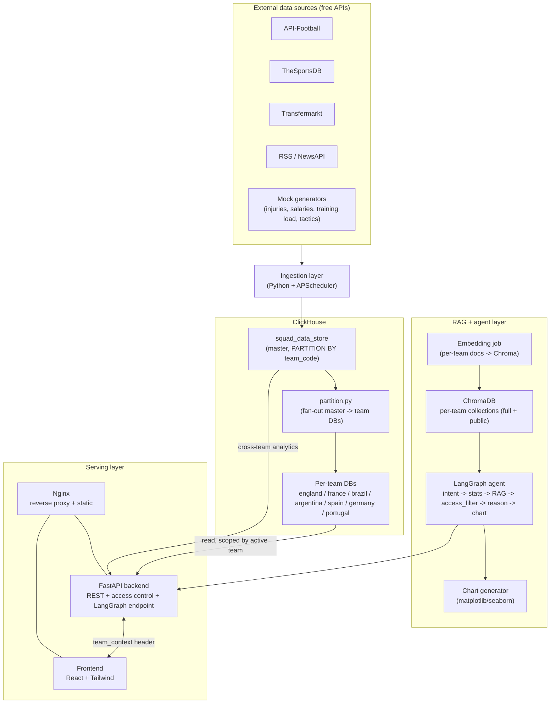
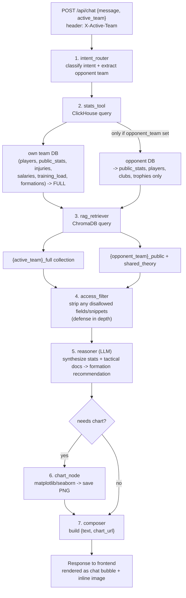
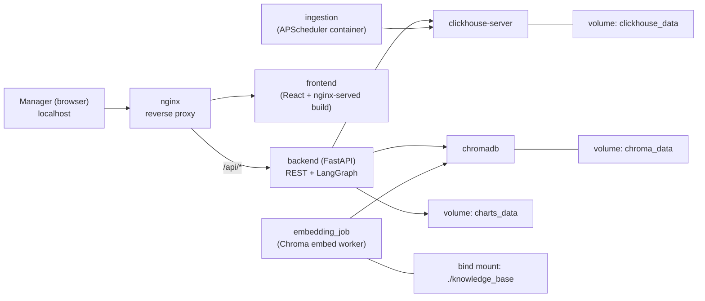

# Diagrams

## 1. High-level architecture

## 2. Chatbot request flow (LangGraph)

## 3. Container & persistence layout

**Persistence rule**: `docker compose stop` / `start` preserves every named volume. Only `docker compose down -v` removes them. This pass only stands up `clickhouse_data` (for the `clickhouse` + `backend` services) — `chroma_data` and `charts_data` get added in their respective phases.

## 4. Access control matrix

| Table | Active team (own data) | Other team (inspect mode) |
|---|---|---|
| `players` (basic fields) | Full | Full |
| `public_stats` | Full | Full |
| `clubs` / `trophies` / `matches` | Full | Full |
| `injuries` | Full | Blocked → `null` |
| `salaries` | Full | Blocked → `null` |
| `training_load` | Full | Blocked → `null` |
| `formations` | Full | `name` + `suitable_vs` only |
